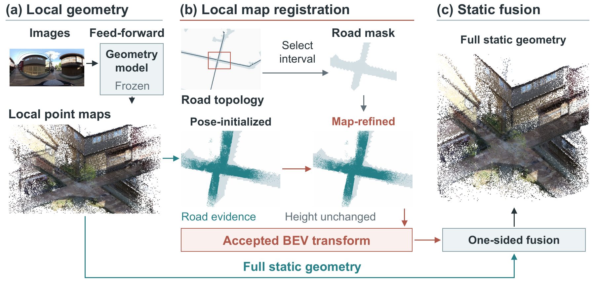

# MapPano3D

**Map-Guided Large-Scale Urban Reconstruction from Panoramic Videos**  
ACCV 2026

Yi Zhu, Kiyoharu Aizawa, Sebastien Valette, Satoshi Ikehata

MapPano3D is a **training-free, backbone-agnostic** framework for assembling
feed-forward local geometry into urban-scale reconstructions. Camera anchors
initialize placement, road topology selects local map support, and semantic
road evidence drives upright BEV registration. The accepted transform aligns
the **full static scene**, including buildings, vegetation, and sidewalks.



The code uses a shared geometry contract with **VGGT, Pi3X, and PanoVGGT
integration interfaces**. Registration consumes point maps, camera poses,
semantic associations, and coordinate conventions rather than a specific
neural architecture; see [the backbone interface](docs/backbones.md).

- **Training-free:** use frozen pretrained geometry models with geometric
  map refinement and full-scene fusion.
- **Reusable across backbones:** connect VGGT, Pi3X, or PanoVGGT through
  shared point-map and camera interfaces.
- **Reproducible evaluation:** follow the complete **VGGT + nuScenes-mini**
  workflow across all ten scenes, from images to independent LiDAR metrics.

## Getting Started

Use Python 3.10 or newer. Install the geometry and evaluation dependencies:

```bash
python -m pip install -r requirements.txt
python -m pip install -r requirements-dev.txt
python -m pytest
```

Backbone inference additionally requires the upstream model environment,
pretrained weights, and a suitable GPU. Mask2Former inference requires its
Detectron2 environment. Install those dependencies using their upstream
instructions; geometry post-processing can run on CPU.

**[VGGT + nuScenes reproduction](docs/reproduction.md)** covers
data preparation, semantic masks, VGGT predictions,
map refinement, full-static fusion, and all-scene geometry evaluation.
For other predictors or your own 360-degree recordings, use the
[backbone contract](docs/backbones.md) and
[custom input specification](docs/custom_360_inputs.md).

## Code Layout

| Directory | Contents |
| --- | --- |
| `mappano3d/` | Shared geometry contract and VGGT/Pi3X/PanoVGGT integration hooks |
| `tools/` | Semantic masks, road-mask extraction, generic BEV refinement, full-cloud export, map evaluation |
| `rebuttal_exp/scripts/` | VGGT adapter, nuScenes LiDAR evaluation and anchor perturbations |
| `rebuttal_exp/configs/` | Experiment configurations, including the 40-image/20-overlap VGGT setting |
| `patches/` | Export/inference changes for the pinned upstream backbone repositories |

## Evaluation

- **MovieMap (Hokkaido and Kanazawa):** panoramic reconstruction and road-map
  consistency across two urban areas using PanoVGGT.
- **nuScenes-mini:** all ten scenes; matched six-camera inputs and 40 total
  camera images per chunk, with 20-image overlap; all-static and non-ground
  LiDAR accuracy, completeness, Chamfer-L1, precision, recall, and F1.

The nuScenes comparison shares VGGT predictions, static filtering, and one
fixed alignment to the ground-truth camera trajectory. Map consistency and
LiDAR geometry are reported separately. See the
[evaluation protocol](docs/reproduction.md#5-lidar-evaluation-and-ten-scene-summary)
for alignment, filtering, metrics, and development settings.

## Data

For panoramic inputs, use your own 360-degree recordings with map support
and camera anchors; see the [input specification](docs/custom_360_inputs.md).
MovieMap route, pose, calibration, and frame-association metadata remain
private. Paper figures and demonstration videos can be shared as visual
results. Obtain nuScenes and pretrained weights from their original providers.

## Citation

```bibtex
@inproceedings{zhu2026mappano3d,
  title={MapPano3D: Map-Guided Large-Scale Urban Reconstruction from Panoramic Videos},
  author={Zhu, Yi and Aizawa, Kiyoharu and Valette, Sebastien and Ikehata, Satoshi},
  booktitle={Asian Conference on Computer Vision (ACCV)},
  year={2026}
}
```

## License and Contact

Our original code is released under the [MIT License](LICENSE).
Upstream models, weights, datasets, and derived patches retain their respective
terms; see [third-party notices](THIRD_PARTY_NOTICES.md).

Corresponding author: Yi Zhu, `yi.zhu@creatis.insa-lyon.fr`.
